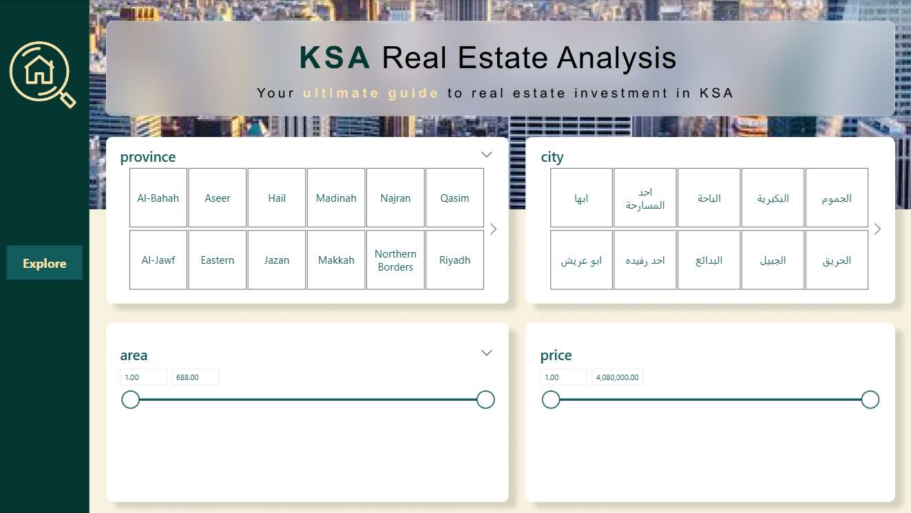
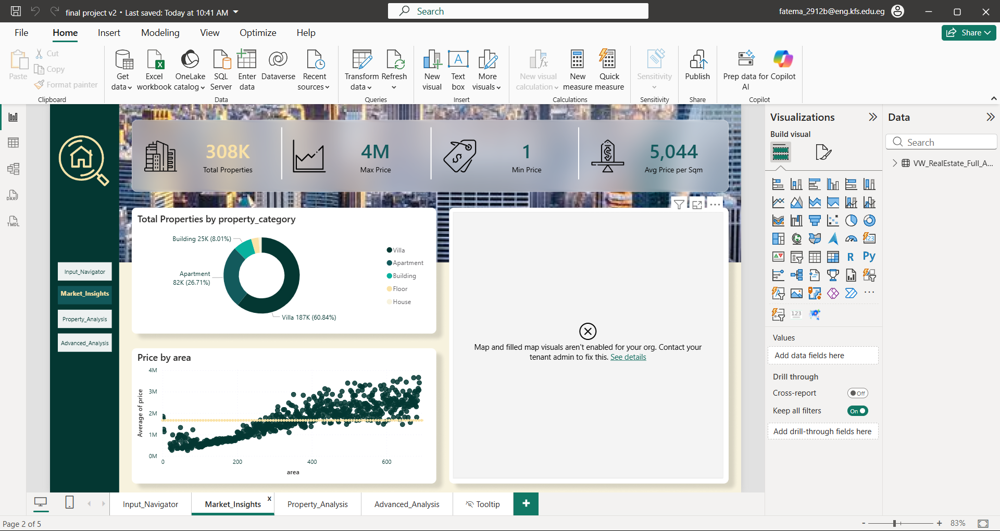
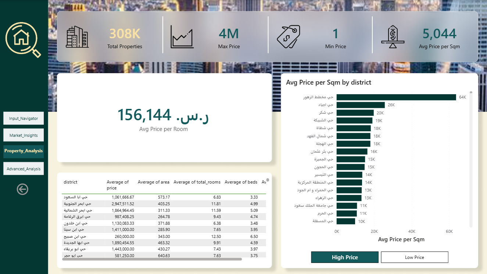
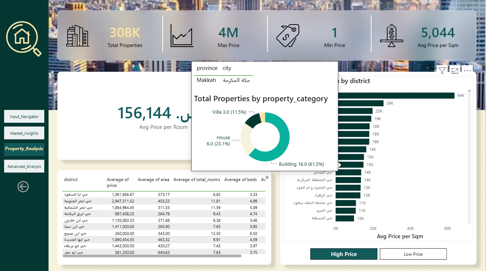
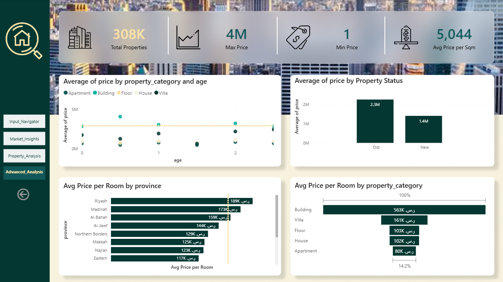
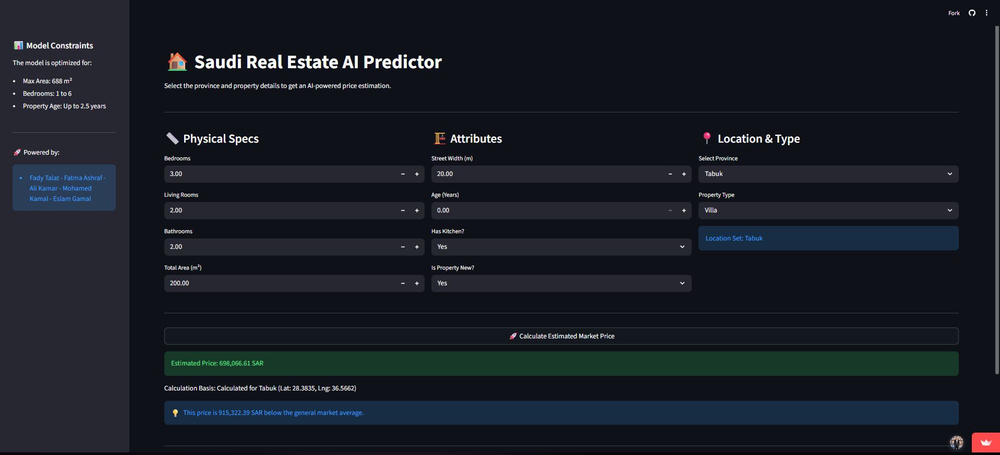

# Intelligent Investment Consultant — KSA Real Estate Market Analysis

> Your ultimate guide to real estate investment in the Kingdom of Saudi Arabia.

---

## 📌 Project Idea

Saving money and investing wisely in real estate is often the next big goal — but with villas, apartments, and chalets all available across a huge market, most clients face too many choices and too little clarity.

This project delivers an end-to-end analytical solution that turns that market noise into investment clarity. By combining exploratory data analysis, interactive visualization, and predictive modeling, the **Intelligent Investment Consultant** takes a user's preferences (such as property type and desired location) and returns optimized investment recommendations along with an accurately predicted property valuation.

---

## 🎯 Project Goals

- Build a clean, query-ready **Star Schema database** from raw Saudi real estate listings to serve as a single source of truth.
- Perform deep **EDA** to uncover the key drivers of property prices across KSA (location, area, age, property type, etc.).
- Design an **interactive Power BI dashboard** that lets investors filter the market by their own budget, region, and preferences.
- Train a **Machine Learning model** capable of predicting residential property prices with high accuracy.
- Deploy a **Streamlit web application** so any user can get an instant price estimate without technical knowledge.

---

## 🛠️ Technologies Used

| Tool / Library | Purpose |
|---|---|
| **Python** (pandas, numpy, scikit-learn, matplotlib, seaborn) | Data preparation, EDA, and Machine Learning |
| **SQL / SQL Server Management Studio (SSMS)** | Database design and data modeling (Star Schema) |
| **Figma** | Dashboard UI/UX design |
| **Power BI** | Interactive dashboards and DAX calculations |
| **Streamlit** | Client-facing prediction web app |
| **Canva** | Workflow presentation |
| **Microsoft Word** | Project documentation |

---

## ✨ Key Features

- **Star Schema data model** (`Fact_Sales`, `Dim_Cities`, `Dim_Districts`) covering 1,959 districts and 97 cities, unified into a single bilingual (Arabic/English) SQL view (`VW_RealEstate_Full_Analysis`).
- **4-page Power BI dashboard** — Input Navigator, Market Insights, Property Analysis, and Advanced Analysis — plus a mobile-optimized layout.
- **Custom-designed visual identity** (Figma-built color palette and logo) reflecting Saudi national colors.
- **Random Forest Regressor** trained on 12 engineered features, achieving an **R² of 0.9084** and a **MAE of 167,930 SAR** on the test set.
- **Live Streamlit prediction app** — instantly estimates a property's price from user-entered specifications.
- Clean, deduplicated dataset of **307,706 residential records** (filtered from 400K+ raw listings) with rigorous outlier and missing-value handling.

🔗 **Live demo:** [Saudi Real Estate AI Predictor](https://predicting-real-estate-prices-in-saudi-arabia-ne64og9uhlvbyyzy.streamlit.app/)
🔗 **Dataset source:** `saudi_real_estate_sale` on Kaggle

---

## 🚀 How to Run the Project

1. **Clone the repository**
```bash
   git clone https://github.com/ItcProjects-R4/ONL4_DAT2_S2_PROJECT2.git
```

2. **Set up the database**
   - Open SQL Server Management Studio (SSMS)
   - Restore `SaudiRealEstate.bak` or import `realestate.bacpac` to recreate the database
   - Run `SQLQueries.sql` to set up the views and tables used in the analysis

3. **Run the EDA & Machine Learning notebooks**
   - Open `Data Preprocessing - Sale.ipynb` and `RandomForestModel.ipynb` in Jupyter Notebook or VS Code
   - Run all cells to reproduce the data cleaning, analysis, and model training

4. **View the Power BI dashboard**
   - Open the `.pbix` file inside the `3 Power BI/1 Dashboard` folder using Power BI Desktop

5. **Run the Streamlit app**
```bash
   pip install -r requirements.txt
   streamlit run app.py
```
   Then open the local URL shown in your terminal (usually `http://localhost:8501`)

   Or you can open it from this link directly `https://predicting-real-estate-prices-in-saudi-arabia-ne64og9uhlvbyyzy.streamlit.app/`


---

## 🖼️ Screenshots

1. **EDA Visualization**


2. **Power BI Dashboard**







**3. **Mobile Layout**
<table>
  <tr>
    <td><br><sub>Input Navigator</sub></td>
    <td><br><sub>Input Navigator 2</sub></td>
    <td><br><sub>Market Insights 2</sub></td>
  </tr>
</table>


<table>
  <tr>
    <td><br><sub>Property Analysis</sub></td>
    <td><br><sub>Property Analysis 2</sub></td>
    <td><br><sub>Advanced Analysis</sub></td>
  </tr>
</table>

4. **Straeamlit App**



<table>
  <tr>
    <td><br><sub>Streamlit Mobile</sub></td>
  </tr>
</table>

---

## 📁 Project Files Overview
```
ONL4_DAT2_TEAM 2 _ Investment Consultant/
│
├── 1 Python - EDA & Cleaning/
│   ├── Datasets/
│   │   ├── Dataset.rar                    # Compressed raw real estate dataset
│   │   ├── sa_cities.csv                  # Reference table of Saudi cities
│   │   └── sa_districts.csv               # Reference table of Saudi districts
│   └── Data Preprocessing - Sale.ipynb    # Data cleaning, EDA, and feature engineering
│
├── 2 SQL/
│   ├── SQLQueries.sql                     # Star schema creation, views, and analysis queries
│   ├── SaudiRealEstate.bak                # Full SQL Server database backup
│   └── realestate.bacpac                  # Portable SQL Server database package
│
├── 3 Power BI/
│   ├── 1 Dashboard/                       # Main 4-page interactive Power BI dashboard
|        └── final project v2
│   ├── 2 Mobile layout dashboard/         # Mobile-optimized dashboard layout
|        └── final project_Dash_Mob
│   └── 3 UI-UX Assets/                    # Figma exports, icons, and design assets
|        ├── Background                    # Background design used across the dashboard pages
|        ├── color palette                 # Color palette reference for the dashboard's visual identity
|        ├── Logo                          # Project logo used in the dashboard and presentation
|        ├── مشروع العقارات الفلاتر       # Figma file for the dashboard's filter UI components
|        └── مشروع العقارات الصفحة الأخيرة   # Final page of the dashboard's UI design
│
├── 4 Machine Learning/
│   ├── RandomForestModel.ipynb            # Model training, evaluation, and price prediction
│   └── app.py                             # Streamlit application source code
│
├── 5 Documentation/
│   ├── Dataset overview and schema Final     # Data dictionary describing tables and columns
│   └── Real Estate Consultant Documentation    # Full project report (problem, methodology, results)
│
└── 6 Presentation/
    └── KSA Real Estate Analysis Presentation  # Final project presentation slides
```
---

## 🧩 Challenges Faced

1. Finding the most efficient dataset for the analysis and machine learning model.
2. Handling the large dataset efficiently to improve performance and scalability, achieved by designing a Star Schema using SQL Server.
3. Achieving the best possible model accuracy required a practical way to use latitude and longitude in a user-friendly Streamlit app. This was solved by replacing raw coordinates with KSA governorates as selectable input options.
4. Documenting each phase of the project effectively, ensuring the documentation and presentation clearly reflect the team's work and capabilities.


## 💡 Future Improvements

1. Connecting the dashboard directly to a real estate website database to get real-time market updates in a faster and easier way.
2. Expanding coverage to include more countries such as Egypt, the UAE, Kuwait, and others.
3. Enabling the model to recommend not only a predicted property price, but also a list of the most suitable locations and property types based on the user's preferences.
4. Allowing the model to compare two different properties a customer is deciding between, helping them make the right choice.
5. Designing a website and a mobile app where both customers and investors can navigate our services, search for properties, and list their own properties for sale.

---

## 👥 Team Members

- **Fady Talat Abdallah** — Team Leader
- **Fatma Ashraf Zain**
- **Ali Kamar**
- **Mohamed El Ashmawy**
- **Eslam Gamal**

---

*This project was developed as a graduation project for the **Digital Egypt Pioneers Initiative (DEPI)**, sponsored by Egypt's Ministry of Communications and Information Technology (MCIT), under the Data Analytics – Microsoft Power BI Specialist track.*
